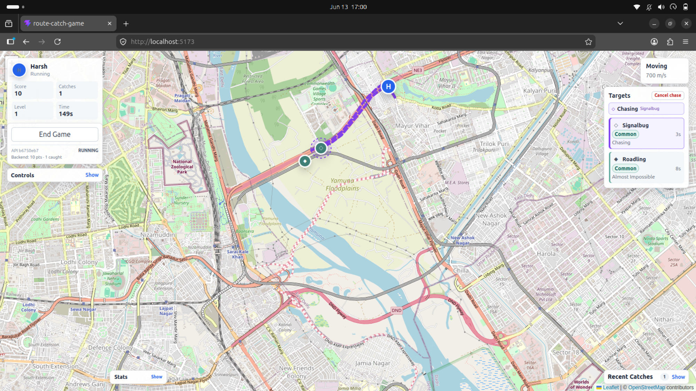
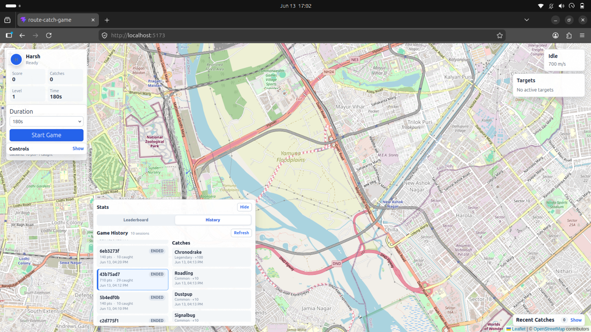
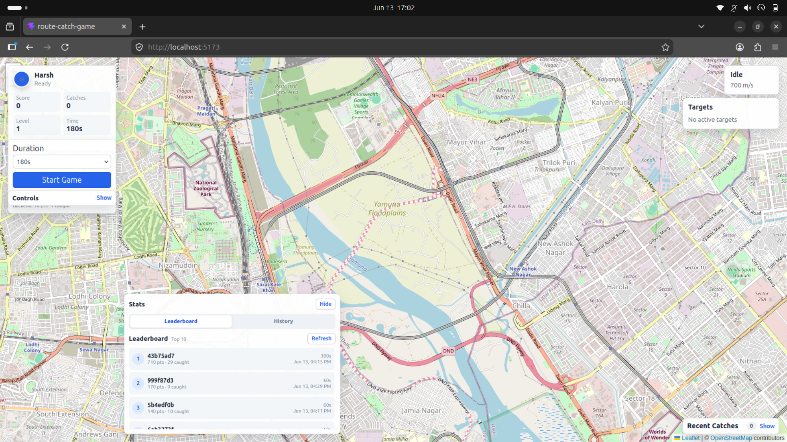
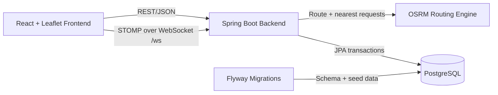

# Route Catch Game

[](https://github.com/halfdimension/route-catch-game/actions/workflows/ci.yml)

**A full-stack map game where players chase creatures along real road routes.**

Route Catch Game combines interactive Leaflet gameplay with OSRM routing,
Spring Boot APIs, and PostgreSQL persistence. Players start timed rounds, chase
rarity-based creatures, follow animated road routes, and build persisted
session history and leaderboard scores. Signed-in players can also keep
user-specific stats and join a live presence room to see other online players
on the map.

`React 19` · `Vite 8` · `Leaflet` · `Java 21` · `Spring Boot 4` ·
`Spring Security` · `JWT` · `WebSocket/STOMP` · `PostgreSQL` · `Flyway` ·
`OSRM` · `Docker Compose`

## Highlights

- Real-road creature chasing with OSRM nearest-road and route integration.
- Animated player movement, active chase state, cancellation, and route
  feedback.
- Common, rare, and legendary creatures with route-based difficulty.
- Timed rounds, score, XP, levels, catch effects, and round summaries.
- Backend-owned creature scoring and persisted game sessions and catches.
- Stats drawer with session history, catch history, and leaderboard.
- JWT authentication with protected current-user APIs.
- Authenticated game sessions linked to users for user-specific stats/history.
- WebSocket/STOMP multiplayer presence for signed-in room members.
- Automatic stale-session expiry and consistent JSON API errors.
- Reproducible PostgreSQL setup and local service scripts.

## Documentation

- [Architecture](docs/ARCHITECTURE.md)
- [API reference](docs/API.md)
- [Demo script](docs/DEMO_SCRIPT.md)
- [Troubleshooting](docs/TROUBLESHOOTING.md)

## Screenshots and Demo

These screenshots are local demo captures of the current application.

### Active Chase Gameplay



### Stats Drawer and History



### Leaderboard



For a concise interview walkthrough, use
[`docs/DEMO_SCRIPT.md`](docs/DEMO_SCRIPT.md). Capture guidance remains in
[`docs/screenshots/README.md`](docs/screenshots/README.md).

## Architecture Overview



- The frontend owns live map rendering, route animation, target spawning,
  catch detection, progression, and game presentation.
- Spring Boot owns routing adapters, JWT auth, backend session lifecycle,
  catalog-backed catch scoring, user-specific history/stats, leaderboard APIs,
  and in-memory multiplayer presence.
- OSRM provides nearest-road snapping and driving routes.
- PostgreSQL stores users, the creature catalog, game sessions, and
  caught-creature snapshots. Flyway creates and seeds the schema.

The browser never calls OSRM or PostgreSQL directly. Spring Boot provides the
application boundary for auth, routing, validation, persistence, history,
leaderboard operations, and multiplayer presence.

Authentication flow:

```text
register/login -> JWT -> Authorization: Bearer token -> /api/auth/me
```

Authenticated session creation stores `game_sessions.user_id` and uses the
user's display name. Guest sessions remain supported with `user_id = null`.

Multiplayer presence flow:

```text
React STOMP client -> /ws -> /app/rooms/{roomId}/presence
                         -> /topic/rooms/{roomId}/presence
```

Presence is in memory for local/demo use. It shows room members on the map but
does not synchronize targets, catches, scoring, or routes.

## Tech Stack

**Frontend**

- React 19 and Vite 8
- Leaflet and React Leaflet
- `@stomp/stompjs`
- JavaScript, CSS, and ESLint

**Backend**

- Java 21
- Spring Boot 4
- Spring Web MVC, Validation, Data JPA, and Maven
- Spring Security, JWT, WebSocket/STOMP
- Flyway

**Infrastructure**

- PostgreSQL
- OSRM using the MLD algorithm

## What This Project Demonstrates

- **Full-stack integration:** coordinated React, Spring Boot, PostgreSQL, and
  OSRM workflows.
- **Routing engine integration:** nearest-road snapping, route geometry,
  distance, duration, and frontend animation.
- **REST and realtime API design:** layered controllers and services, DTO
  validation, stable response contracts, history queries, and STOMP presence
  messaging.
- **Persistence and migrations:** JPA transactions, relational game records,
  deterministic Flyway schema creation, and catalog seed data.
- **Frontend state management:** concurrent local gameplay, backend session
  synchronization, route request guards, and resilient non-blocking updates.
- **Error handling:** consistent API errors and graceful frontend fallback when
  routing, history, or backend synchronization is unavailable.
- **Developer tooling:** Docker Compose for PostgreSQL, service orchestration,
  diagnostics, tests, build checks, and focused project documentation.

## Local Prerequisites

- Bash and `curl`
- Java 21
- Node.js `20.19+` or `22.12+` and npm
- Docker with Docker Compose for the recommended PostgreSQL setup, or a local
  PostgreSQL installation
- `psql` for manual database setup and inspection
- A built OSRM server and prepared MLD dataset

The checked-in OSRM scripts currently use these machine-specific paths:

```text
/home/halfdimension/Projects/practice/osrm-backend/build/osrm-routed
/home/halfdimension/Projects/osrm-data/northern-zone-latest.osrm
```

Update `scripts/run-osrm.sh` when OSRM or its dataset is located elsewhere.
The dataset prefix must have at least `.ebg`, `.partition`, and `.cells`
companion files.

## Environment Configuration

Create the frontend environment file:

```bash
cp frontend/.env.example frontend/.env
```

Default value:

```env
VITE_API_BASE_URL=http://localhost:8080
```

The root `.env.example` contains the matching Docker Compose database defaults:

```env
POSTGRES_DB=route_catch_game
POSTGRES_USER=route_catch_user
POSTGRES_PASSWORD=route_catch_pass
```

The Compose file uses these values as defaults, so copying the root file is not
required. If you customize them through a root `.env`, update the backend
datasource settings to match.

The backend defaults are in
`backend/route-catch-api/src/main/resources/application.properties`:

```properties
spring.datasource.url=jdbc:postgresql://localhost:5432/route_catch_game
spring.datasource.username=route_catch_user
spring.datasource.password=route_catch_pass
osrm.base-url=http://localhost:5000
```

## PostgreSQL Setup with Docker Compose

This is the recommended setup for local development:

```bash
docker compose up -d postgres
```

Check container status and readiness:

```bash
docker compose ps
docker compose logs postgres
```

The `route-catch-postgres` container exposes PostgreSQL on
`localhost:5432` and stores data in the named
`route-catch-postgres-data` volume.

Stop the container while preserving data:

```bash
docker compose down
```

To fully reset the local database:

```bash
docker compose down -v
docker compose up -d postgres
```

`docker compose down -v` permanently deletes the named database volume and all
local sessions and catches. Use it only when a clean database is intended.

## Manual PostgreSQL Setup

As an alternative to Docker, create the local role and database once:

```bash
sudo -u postgres psql
```

```sql
CREATE USER route_catch_user WITH PASSWORD 'route_catch_pass';
CREATE DATABASE route_catch_game OWNER route_catch_user;
\q
```

On backend startup, Flyway applies:

- `V1__create_game_tables.sql`
- `V2__seed_creature_catalog.sql`
- `V3__add_player_name_to_game_sessions.sql`

JPA uses `ddl-auto=validate`, so Flyway remains responsible for schema changes.

## Quick Start

PostgreSQL must already be running, either through Docker Compose or a local
installation. From the project root:

```bash
docker compose up -d postgres
./scripts/run-all.sh
```

This starts:

- OSRM at `http://localhost:5000`
- Spring Boot at `http://localhost:8080`
- Vite at `http://localhost:5173`

Open `http://localhost:5173`. Press Ctrl+C in the script terminal to stop the
managed OSRM and backend processes along with the frontend.

Frontend and backend are enough to test authentication and multiplayer
presence. OSRM is required for route movement, nearest-road snapping, and target
chasing.

Check prerequisites and live services with:

```bash
./scripts/check-system.sh
```

## Run Services Separately

Separate terminals are useful when inspecting logs.

Terminal 1:

```bash
./scripts/run-osrm.sh
```

Terminal 2:

```bash
./scripts/run-backend.sh
```

Terminal 3:

```bash
./scripts/run-frontend.sh
```

Equivalent direct commands:

```bash
cd backend/route-catch-api
./mvnw spring-boot:run
```

```bash
cd frontend
npm install
npm run dev
```

## Tests and Builds

Backend tests use H2 and do not require the local PostgreSQL instance:

```bash
cd backend/route-catch-api
./mvnw clean test
```

Frontend verification:

```bash
cd frontend
npm run build
npm run lint
```

Shell script syntax:

```bash
bash -n scripts/run-all.sh
bash -n scripts/run-osrm.sh
bash -n scripts/run-backend.sh
bash -n scripts/run-frontend.sh
bash -n scripts/check-system.sh
```

## Gameplay Flow

1. Choose a round duration and start the game.
2. Optionally register or sign in. Authenticated sessions are linked to the
   user; guests still play without an account.
3. The frontend creates and starts a persisted backend session.
4. Targets spawn, snap to nearby roads, and receive route-based difficulty.
5. Click a target marker or Targets row to fetch a route and begin chasing.
6. Catch creatures to receive immediate local score, XP, and visual feedback.
7. The frontend submits each creature ID to the backend without blocking play.
8. The backend validates catalog score, stores the catch, and updates the
   persisted session totals.
9. End the round and open Stats to inspect My Stats, History, and Leaderboard
   data.
10. Signed-in players can join a multiplayer room such as `delhi` and see other
    online room members on the map.

## Project Structure

```text
frontend/
  src/
    api/          Spring Boot API clients
    components/   Map, HUD, targets, feedback, Stats, history, leaderboard
    config/       API, game, map, routing, and progression settings
    data/         Frontend creature presentation and mock player profile
    hooks/        Movement, spawning, sessions, catches, progression, presence
    styles/       Global application styles
    utils/        Rarity and browser sound helpers
backend/route-catch-api/
  src/main/java/com/routecatch/api/
    auth/         Registration, login, JWT, current user, security config
    controller/   Health, route, and nearest endpoints
    dto/          Shared routing and error DTOs
    exception/    Global JSON error handling
    game/         Catalog, sessions, catches, history, and leaderboard
    multiplayer/  WebSocket/STOMP room presence
    service/      OSRM routing integration
  src/main/resources/db/migration/
docs/
scripts/
docker-compose.yml
```

## Common Troubleshooting

- **Backend cannot start:** verify PostgreSQL is running and the configured
  database, user, and password exist.
- **PostgreSQL container cannot start:** inspect `docker compose logs postgres`
  and check whether host port `5432` is already occupied.
- **Flyway reports schema permission errors:** grant the application role
  permission on the `public` schema. See
  [Troubleshooting](docs/TROUBLESHOOTING.md).
- **Routing returns `502`:** start OSRM and verify the configured dataset covers
  the coordinates being requested.
- **Frontend cannot reach the API or WebSocket:** confirm `frontend/.env` points to
  `http://localhost:8080` and restart Vite after changing it.
- **Browser shows method not allowed:** `/api/routes`, `/api/nearest`, and catch
  submission are POST endpoints, not browser-tab GET pages.
- **A port is busy:** find and stop the process using ports `5000`, `8080`,
  `5173`, or `5432`.

See [docs/TROUBLESHOOTING.md](docs/TROUBLESHOOTING.md) for commands and detailed
fixes.

## Current Limitations

- OSRM binary and dataset paths in `scripts/run-osrm.sh` are local-machine
  dependent.
- The frontend and runtime scripts are currently focused on local demos.
- No hosted deployment pipeline is configured.
- Live spawning, movement, and catch detection remain frontend-controlled.
- Multiplayer currently covers presence only; shared targets, catches, scoring,
  and route synchronization are future work.

## Roadmap

- User profile editing and avatar storage
- Hosted frontend, backend, database, and routing deployment
- Richer creature catalog, abilities, and collection views
- Route challenges, objectives, and location-based events
- Player analytics, profile statistics, and deeper leaderboards
- Stronger server-authoritative gameplay validation
