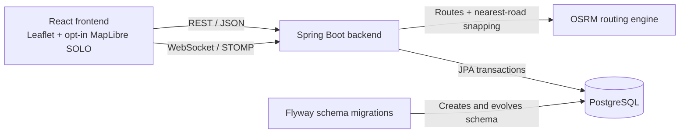
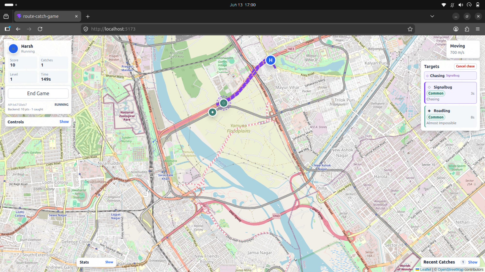
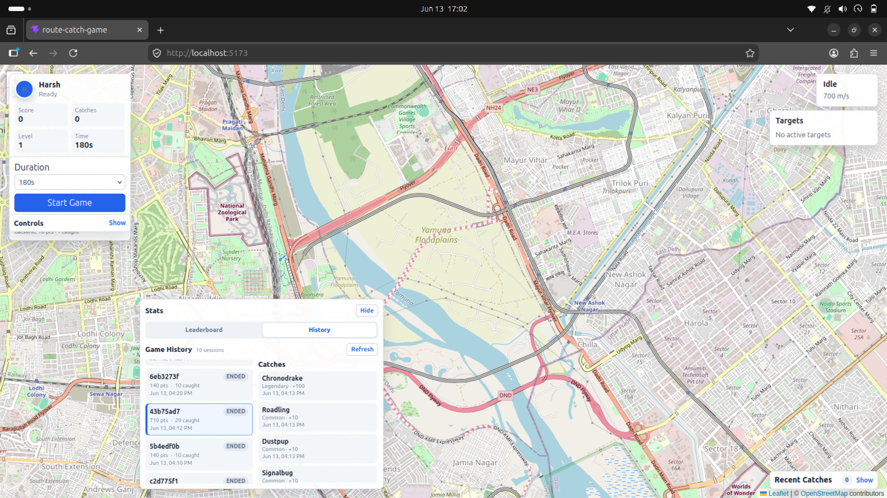
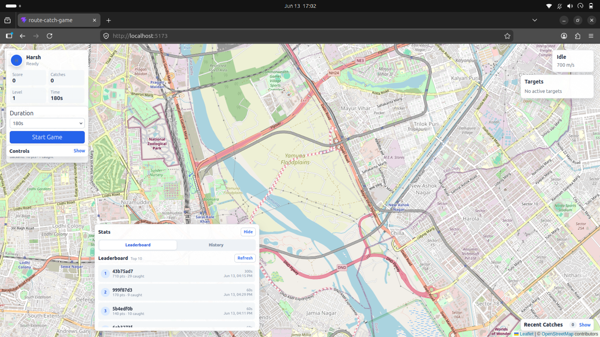

# Route Catch Game

[](https://github.com/halfdimension/route-catch-game/actions/workflows/ci.yml)

**A full-stack creature-catching game played across real road routes.**

Route Catch Game combines responsive SOLO play with authenticated multiplayer
rooms. A React frontend renders the world with Leaflet by default or MapLibre
for opt-in SOLO play, while a Spring Boot backend integrates OSRM routing, JWT
authentication, WebSocket/STOMP communication, and PostgreSQL persistence.

`React 19` · `Vite 8` · `Leaflet` · `MapLibre` · `Java 21` ·
`Spring Boot 4.1` · `JWT` · `WebSocket/STOMP` · `PostgreSQL` · `Flyway` ·
`OSRM` · `Docker Compose`

## Highlights

- Real-road routes and nearest-road snapping through OSRM.
- Timed SOLO rounds with animated route movement, route-based catches, and
  common, rare, and legendary chase targets.
- Immediate score, XP, levels, catch feedback, and persisted session history.
- Active SOLO round recovery after browser refresh, including reconstructed
  player movement, route, targets, caught state, score, timer, and pending catch
  synchronization.
- Stable catch UUIDs and idempotent backend synchronization prevent a recovered
  SOLO catch from being scored twice.
- Leaflet as the default SOLO and multiplayer renderer, plus an opt-in MapLibre
  SOLO renderer with `OVERVIEW`, `FOLLOW`, and `FREE` navigation modes.
- JWT registration/login, identity-scoped stats and history, and leaderboard
  views.
- Authenticated multiplayer rooms with presence, shared creatures, timed
  rounds, backend-generated movement routes, catch ownership, and scoring.
- Backend-authoritative multiplayer round, route, creature, catch-transition,
  and score state, with the catch-distance caveat described below.
- Completed multiplayer results, rankings, catch snapshots, and personal match
  history persisted in PostgreSQL.

## Architecture


```mermaid
flowchart LR
    frontend["React frontend<br/>Leaflet + opt-in MapLibre SOLO"]
    backend["Spring Boot backend"]
    osrm["OSRM routing engine"]
    postgres[("PostgreSQL")]
    flyway["Flyway schema migrations"]

    frontend -->|REST / JSON| backend
    frontend -->|WebSocket / STOMP| backend
    backend -->|Routes + nearest-road snapping| osrm
    backend -->|JPA transactions| postgres
    flyway -->|Creates and evolves schema| postgres
```

The browser talks to Spring Boot rather than directly to OSRM or PostgreSQL.
Flyway owns database schema changes; Hibernate validates the resulting schema.

### SOLO and Multiplayer Use Different Authority Models

**SOLO** is deliberately responsive and frontend-driven. The frontend owns the
live timer, target lifecycle, route animation, catches, score, and progression;
the backend provides OSRM adapters, session support, catalog validation, and
persistence. A transient browser checkpoint can restore an interrupted active
round without turning SOLO into server-authoritative gameplay.

**Multiplayer** is progressively backend-authoritative. The backend owns the
important round lifecycle, shared creature population, route generation and
movement plans, one-winner catch transitions, scoring, finalization, and
completed-result persistence. The frontend sends movement intent and renders
the authoritative timeline and room events.

One trust boundary remains: multiplayer catch distance is currently calculated
by the backend from coordinates submitted by the client. Creature ownership,
concurrency, catch recording, and scoring are backend-owned, but the distance
input is not yet fully tamper-resistant.

## SOLO Refresh Recovery

Normal SOLO play remains memory-first. During an active round, a versioned,
identity-scoped checkpoint provides short-lived recovery evidence:

```text
browser refresh
    -> transient IndexedDB checkpoint
    -> absolute wall-clock reconstruction
    -> restore player, route, targets, catches, timer, score, and XP
    -> continue gameplay
```

- Movement resumes from its reconstructed route distance instead of restarting
  at the beginning.
- Time spent reloading counts against both movement and the round timer.
- Known target expiry, caught state, and movement intent are reconstructed.
- Pending catch replay reuses stable catch UUIDs; the backend treats an exact
  retry as idempotent and does not award score twice.
- An already-moving recovered MapLibre route enters `FOLLOW` directly instead
  of repeating the fresh-route overview.

PostgreSQL remains the durable store for sessions and history. IndexedDB is a
TTL-bound recovery mechanism, not permanent game history. See the
[canonical engineering context](POKEMON_GAME_CONTEXT.md) for checkpoint,
timeline, and concurrency internals.

## Map Renderers

**Leaflet / React Leaflet** is the default gameplay renderer and the only
current multiplayer renderer.

**MapLibre GL / React MapLibre** is an opt-in SOLO renderer. Enable it from the
`frontend` directory:

```bash
VITE_SOLO_MAP_RENDERER=maplibre \
VITE_ENABLE_DEBUG_CONTROLS=true \
npm run dev
```

Its navigation camera uses three presentation modes:

- `OVERVIEW` frames a fresh route and destination before movement.
- `FOLLOW` tracks the moving player with route-aware heading and look-ahead.
- `FREE` lets the player explore manually and then resume follow mode.

MapLibre camera state is presentation-only; Leaflet and MapLibre consume the
same SOLO gameplay state. MapLibre is not wired into multiplayer.

## Screenshots

The existing captures show the Leaflet SOLO experience. They predate the
MapLibre renderer and do not represent every current multiplayer or recovery
feature.

### Active Chase Gameplay



### Persisted SOLO Session and Catch History



### SOLO Session Leaderboard



For a concise walkthrough, see the [demo script](docs/DEMO_SCRIPT.md). Capture
guidance is in [docs/screenshots/README.md](docs/screenshots/README.md).

## Tech Stack

**Frontend**

- React 19, Vite 8, and JavaScript
- Leaflet 1.9 / React Leaflet 5
- MapLibre GL 5 / React MapLibre 8
- STOMP client, React Router, CSS, and ESLint

**Backend**

- Java 21 and Spring Boot 4.1
- Spring MVC, Validation, Security, and Data JPA
- JWT with JJWT
- WebSocket/STOMP
- Flyway and Maven

**Infrastructure**

- PostgreSQL
- OSRM using the MLD algorithm
- Docker Compose for local PostgreSQL

## Local Development

### Prerequisites

- Bash and `curl`
- Java 21
- Node.js `20.19+`, `22.13+`, or `24+` and npm
- Docker with Docker Compose, or an equivalent local PostgreSQL installation
- A built OSRM server and prepared MLD dataset
- Optional: `psql` for manual database setup and inspection

### Environment

Create the frontend environment file:

```bash
cp frontend/.env.example frontend/.env
```

Its default API URL is:

```env
VITE_API_BASE_URL=http://localhost:8080
```

Docker Compose defaults to:

```env
POSTGRES_DB=route_catch_game
POSTGRES_USER=route_catch_user
POSTGRES_PASSWORD=route_catch_pass
```

The backend's matching local defaults are in
`backend/route-catch-api/src/main/resources/application.properties`, including
`osrm.base-url=http://localhost:5000`.

### Start the Services

Run these in order from the repository root, using separate terminals for the
long-running processes.

1. Start PostgreSQL:

   ```bash
   docker compose up -d postgres
   ```

2. Start OSRM:

   ```bash
   ./scripts/run-osrm.sh
   ```

3. Start Spring Boot:

   ```bash
   ./scripts/run-backend.sh
   ```

4. Start Vite:

   ```bash
   cd frontend
   npm install
   npm run dev
   ```

Open `http://localhost:5173`. The backend and OSRM default to ports `8080` and
`5000`; PostgreSQL defaults to `5432`.

The checked-in all-in-one helper is also available after PostgreSQL is ready:

```bash
./scripts/run-all.sh
```

Run `./scripts/check-system.sh` to check prerequisites and service health.

### OSRM Path Configuration

The checked-in OSRM scripts currently contain machine-specific paths:

```text
/home/halfdimension/Projects/practice/osrm-backend/build/osrm-routed
/home/halfdimension/Projects/osrm-data/northern-zone-latest.osrm
```

Update `scripts/run-osrm.sh` and `scripts/check-system.sh` if the binary or
dataset lives elsewhere. The dataset prefix must include the `.ebg`,
`.partition`, and `.cells` MLD companion files.

### PostgreSQL and Flyway

The Compose service stores data in the `route-catch-postgres-data` named volume.
Flyway currently applies:

- `V1__create_game_tables.sql`
- `V2__seed_creature_catalog.sql`
- `V3__add_player_name_to_game_sessions.sql`
- `V4__create_users_and_link_sessions.sql`
- `V5__create_multiplayer_round_results.sql`

V5 adds durable completed multiplayer rounds, participant results, and catch
snapshots. SOLO catch idempotency reuses the catch UUID primary key created in
V1 and required no additional migration. JPA uses `ddl-auto=validate`.

Without Docker, create the matching local role and database once:

```bash
sudo -u postgres psql
```

```sql
CREATE USER route_catch_user WITH PASSWORD 'route_catch_pass';
CREATE DATABASE route_catch_game OWNER route_catch_user;
\q
```

To stop PostgreSQL while preserving data:

```bash
docker compose down
```

To intentionally delete the local database volume and rebuild it:

```bash
docker compose down -v
docker compose up -d postgres
```

`docker compose down -v` permanently deletes local users, sessions, catches,
and multiplayer history stored in that volume.

## Selected API Surface

The README lists representative routes; use the current controllers as the
ultimate contract.

```text
Authentication
POST /api/auth/register
POST /api/auth/login
GET  /api/auth/me

Routing
POST /api/routes
POST /api/nearest
GET  /api/health

SOLO sessions and history
GET  /api/game/creatures
POST /api/game/sessions
POST /api/game/sessions/{sessionId}/start
POST /api/game/sessions/{sessionId}/end
POST /api/game/sessions/{sessionId}/catches
GET  /api/game/me/stats
GET  /api/game/me/sessions
GET  /api/game/leaderboard

Multiplayer rooms and live state
POST /api/multiplayer/rooms
POST /api/multiplayer/rooms/{roomCode}/join
POST /api/multiplayer/rooms/{roomCode}/game/start
GET  /api/multiplayer/rooms/{roomCode}/game
GET  /api/multiplayer/rooms/{roomCode}/movements
GET  /api/multiplayer/rooms/{roomCode}/creatures
POST /api/multiplayer/rooms/{roomCode}/creatures/{instanceId}/catch

Completed multiplayer results
GET /api/multiplayer/rooms/{roomCode}/rounds/{roundId}/result
GET /api/multiplayer/rooms/{roomCode}/rounds/latest/result
GET /api/multiplayer/me/rounds?page=0&size=20
```

Authenticated STOMP clients connect at `/ws`, publish presence and movement
commands under `/app/rooms/{roomCode}/...`, and subscribe to room presence,
creature, movement, and `GAME_ENDED` event topics under
`/topic/rooms/{roomCode}/...`.

## Testing and Quality

Backend tests use H2 in PostgreSQL compatibility mode:

```bash
cd backend/route-catch-api
./mvnw clean test
```

Frontend verification:

```bash
cd frontend
node --test test/*.test.js
npm run test:maplibre
npm run lint
npm run build
```

GitHub Actions runs Maven tests plus the frontend production build and lint on
pushes to `main` and pull requests targeting `main`. The workflow does not
currently run the frontend Node test suite, so it should be run locally during
feature verification. Map rendering and camera feel also receive manual browser
validation; there is not yet a full browser E2E suite.

## What This Project Demonstrates

- Full-stack system design across React, Spring Boot, PostgreSQL, and OSRM.
- Real routing-engine integration and frontend route-animation/game-state
  architecture.
- Explicit frontend/backend authority boundaries for SOLO and multiplayer.
- Concurrency-safe shared catches, idempotent synchronization, transactional
  persistence, and immutable completed-round snapshots.
- JWT identity and authenticated REST/WebSocket communication.
- Browser refresh/crash recovery with durable-versus-transient state separation.
- Lifecycle, generation, and ABA race protection around asynchronous gameplay.
- Renderer abstraction across Leaflet and MapLibre without duplicating game
  rules.
- Automated backend/frontend verification plus focused manual map validation.

## Current Limitations

- MapLibre is SOLO-only; multiplayer uses Leaflet.
- Active multiplayer rooms, presence, movement plans, creatures, spawn loops,
  and finalization context remain single-JVM/in-memory. A backend restart does
  not reconstruct an active round, and the current design is not ready for
  arbitrary horizontal scaling.
- Multiplayer has no SOLO-style active-round browser checkpoint recovery. REST
  snapshots and persisted completed results cover selected reconnect and
  completion-recovery paths.
- Multiplayer catch distance still trusts client-submitted coordinates, even
  though catch ownership and scoring are enforced by the backend.
- SOLO checkpoints are transient and TTL-bound. Known targets recover, but
  random spawn opportunities missed while the browser is unavailable are not
  deterministically replayed.
- There is no Redis/Kafka distributed multiplayer authority or durable message
  broker/outbox; PostgreSQL is the durable store for historical state.
- Local OSRM scripts contain machine-specific paths, and no complete hosted
  deployment pipeline is configured.

## Documentation

- [Canonical engineering context / current implementation handoff](POKEMON_GAME_CONTEXT.md)
- [Architecture overview](docs/ARCHITECTURE.md) — supporting documentation that
  may lag the canonical context and current source
- [API reference](docs/API.md) — supporting endpoint documentation that may lag
  the current controllers
- [Demo script](docs/DEMO_SCRIPT.md)
- [Troubleshooting](docs/TROUBLESHOOTING.md)
