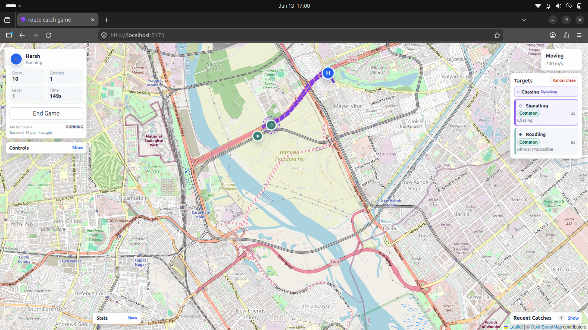

# Route Catch Game

[](https://github.com/halfdimension/route-catch-game/actions/workflows/ci.yml)

**A full-stack creature-catching game played across real travel routes.**

Route Catch Game combines responsive SOLO play with authenticated,
backend-authoritative multiplayer rooms. React renders the map with Leaflet by
default or MapLibre for opt-in SOLO play. Spring Boot provides a
provider-neutral routing API over OSRM and Valhalla, JWT authentication,
WebSocket/STOMP multiplayer coordination, and PostgreSQL persistence.

`React 19` · `Vite 8` · `Leaflet` · `MapLibre` · `Java 21` ·
`Spring Boot 4.1` · `JWT` · `WebSocket/STOMP` · `PostgreSQL` · `Flyway` ·
`OSRM` · `Valhalla`

## Current Capabilities

- Timed SOLO rounds with animated route movement, target spawning, route-based
  catches, score, XP, levels, and session history.
- Three provider-neutral SOLO travel modes: `CAR`, `MOTORCYCLE`, and `WALKING`.
- `CAR` route/nearest requests through OSRM; `MOTORCYCLE` and `WALKING`
  through Valhalla motorcycle and pedestrian costing.
- A Spring Boot routing façade; the browser does not call either routing
  provider as authoritative application infrastructure.
- No silent provider fallback. A failure of the selected provider is exposed.
- Identity-scoped SOLO refresh recovery using checkpoint schema v2, including
  active travel mode, absolute round time, reconstructed movement, targets,
  score/XP, and pending catch synchronization.
- Mode-compatible SOLO target publication: the same active mode is used for
  nearest snapping and a validation route before a target becomes visible.
- Leaflet as the default SOLO and multiplayer renderer.
- Opt-in MapLibre SOLO rendering with `OVERVIEW`, `FOLLOW`, and `FREE` camera
  modes.
- JWT registration/login and authenticated REST/STOMP communication.
- Multiplayer rooms with backend-owned round lifecycle, OSRM movement plans,
  shared creatures, one-winner catch transitions, scoring, sequencing,
  generation guards, and result finalization.
- Durable completed multiplayer rounds, participant rankings, catch snapshots,
  and current-user match history in PostgreSQL.

There is no `BICYCLE` travel mode. Travel-mode selection is a SOLO feature;
multiplayer remains on its established OSRM-only authoritative routing path.

## Architecture at a Glance

```text
Browser / React / Vite
          |
          | REST + WebSocket/STOMP
          v
     Spring Boot
       /   |    \
      /    |     \
     v     v      v
   OSRM  Valhalla PostgreSQL
```

Responsibilities:

| Component | Current responsibility |
|---|---|
| OSRM | SOLO `CAR` route/nearest; multiplayer authoritative routes; multiplayer creature road snapping |
| Valhalla | SOLO `MOTORCYCLE` and `WALKING` route/nearest |
| PostgreSQL | Users; SOLO sessions/catches/history; durable completed multiplayer results/history |
| IndexedDB | Transient, identity-scoped SOLO active-round recovery checkpoint |

SOLO and multiplayer deliberately use different authority models. SOLO remains
responsive and frontend-driven. Multiplayer route, shared-creature,
catch-transition, score, and round authority lives in the backend. See
[`docs/ARCHITECTURE.md`](docs/ARCHITECTURE.md) for the structural overview and
[`POKEMON_GAME_CONTEXT.md`](POKEMON_GAME_CONTEXT.md) for the canonical
engineering handoff.

## SOLO Travel Modes

At launch or restart, the current setup choice is captured as the immutable
active mode for that round:

```text
selectedTravelMode  ->  activeTravelMode
```

The selector is locked during synchronous launch, `STARTING`, and `RUNNING`.
It becomes editable in `RECONCILING`, so a player may choose the next round's
mode while old catch synchronization completes. That new choice does not
rewrite the old checkpoint's mode.

Travel mode controls routing semantics. It does not control visual movement
speed. `simulationSpeedMetersPerSecond` remains the game movement-speed
authority, and provider duration does not drive the animation speed.

## SOLO Refresh Recovery

The current checkpoint schema is version 2. It requires
`checkpoint.round.travelMode` and restores the active mode from that field.
A genuine schema-v1 record is validated as v1, migrated in memory to v2 with
`CAR`, and then validated as v2. The IndexedDB database version remains 1.

Recovery preserves semantic state, not rendered frames or provider identity:

```text
browser refresh
    -> resolve authenticated/guest identity
    -> read and validate transient IndexedDB checkpoint
    -> reconstruct absolute round time and route distance
    -> restore activeTravelMode, movement, targets, score/XP, and pending sync
    -> continue through Leaflet or MapLibre
```

Checkpoints are TTL-bound recovery evidence, not permanent history. PostgreSQL
remains the durable store for sessions, catches, and completed results.

## Renderers

Leaflet is the current default SOLO renderer and the multiplayer renderer.

MapLibre is opt-in for SOLO:

```bash
cd frontend
VITE_SOLO_MAP_RENDERER=maplibre npm run dev
```

Development controls can additionally be enabled with:

```env
VITE_ENABLE_DEBUG_CONTROLS=true
```

MapLibre consumes the same gameplay and travel-mode truth as Leaflet. Its
camera modes are presentation-only:

- `OVERVIEW` frames a fresh route.
- `FOLLOW` tracks the moving player.
- `FREE` permits manual exploration and can resume follow.

Recovered already-moving MapLibre routes enter `FOLLOW` directly. MapLibre is
not wired into multiplayer and was not fully live-browser validated for every
mode during PR #18; productionization remains future work.

## Screenshots

The existing screenshots show an older Leaflet SOLO UI and do not prove the
current TravelMode, Valhalla, MapLibre, recovery-v2, or multiplayer-result
features. See [`docs/screenshots/README.md`](docs/screenshots/README.md) for
their exact status and future capture guidance.



## Local Development

### Prerequisites

- Bash and `curl`
- Java 21
- Node.js 22 and npm
- Docker with Docker Compose, or an equivalent PostgreSQL installation
- A built OSRM server with a prepared MLD dataset
- A separately prepared Valhalla instance for `MOTORCYCLE`/`WALKING`
- Optional: `psql` for database inspection

### Default Local Services

| Service | Default address |
|---|---|
| Vite | `http://localhost:5173` |
| Spring Boot | `http://localhost:8080` |
| OSRM | `http://localhost:5000` |
| Valhalla | `http://localhost:8002` |
| PostgreSQL | `localhost:5432` |

The backend defaults are committed in
`backend/route-catch-api/src/main/resources/application.properties`:

```properties
osrm.base-url=http://localhost:5000
valhalla.base-url=http://localhost:8002
valhalla.connect-timeout=2s
valhalla.read-timeout=10s
```

Create the frontend environment file:

```bash
cp frontend/.env.example frontend/.env
```

Its normal API setting is:

```env
VITE_API_BASE_URL=http://localhost:8080
```

### Start the Stack

1. Start PostgreSQL:

   ```bash
   docker compose up -d postgres
   ```

2. Start a separately prepared Valhalla instance on `localhost:8002` if the
   demo or development session will use `MOTORCYCLE` or `WALKING`.

   The repository does **not** contain a portable Valhalla launcher, tile-build
   workflow, or container service. Historical PR #18 validation used an
   externally prepared local Valhalla instance at that address.

3. Start the committed application helper:

   ```bash
   ./scripts/run-all.sh
   ```

`run-all.sh` starts OSRM, Spring Boot, and Vite. It does not start PostgreSQL or
Valhalla. The committed `check-system.sh` checks PostgreSQL, OSRM, backend
health, and default CAR route/nearest calls; it does not check Valhalla.

Services can also be started separately:

```bash
./scripts/run-osrm.sh
./scripts/run-backend.sh
./scripts/run-frontend.sh
```

### Current Local-Tooling Limitations

The OSRM scripts contain author-machine binary and dataset paths. They must be
adapted on another machine. No uncommitted local-tooling experiment is part of
the current behavior. Portable routing startup and provider readiness work is
listed only in [`docs/ROADMAP.md`](docs/ROADMAP.md).

### PostgreSQL and Flyway

Compose uses the documented local defaults:

```text
database  route_catch_game
user      route_catch_user
password  route_catch_pass
```

Flyway owns schema evolution and Hibernate uses `ddl-auto=validate`. Current
migrations are V1 through V5; V5 creates durable multiplayer round, participant,
and catch-snapshot tables. SOLO catch idempotency reuses the V1 catch UUID
primary key and required no new migration.

## Representative API Surface

```text
POST /api/routes
POST /api/nearest
GET  /api/health

POST /api/auth/register
POST /api/auth/login
GET  /api/auth/me

POST /api/game/sessions
POST /api/game/sessions/{sessionId}/start
POST /api/game/sessions/{sessionId}/catches
POST /api/game/sessions/{sessionId}/end

GET /api/multiplayer/rooms/{roomCode}/rounds/{roundId}/result
GET /api/multiplayer/rooms/{roomCode}/rounds/latest/result
GET /api/multiplayer/me/rounds?page=0&size=20
```

Routing requests accept an optional, case-sensitive `travelMode`. Missing or
JSON `null` defaults to `CAR`; valid values are `CAR`, `MOTORCYCLE`, and
`WALKING`. Unsupported values return `400 UNSUPPORTED_TRAVEL_MODE`. Responses
do not echo `travelMode`. See [`docs/API.md`](docs/API.md) for the contract.

Authenticated STOMP clients connect at `/ws`, send presence and movement
commands under `/app/rooms/{roomCode}/...`, and subscribe to presence,
creature, movement, and room-event topics under
`/topic/rooms/{roomCode}/...`.

## Testing and Quality

Backend suite:

```bash
cd backend/route-catch-api
./mvnw clean test
```

Frontend suite and quality checks:

```bash
cd frontend
node --test test/*.test.js
npm run test:maplibre
npm run lint
npm run build
```

GitHub Actions runs the Maven tests plus frontend build and lint. It does not
currently run the complete frontend Node test suite. The repository has no full
browser E2E suite.

Historical PR #18 verification recorded 407 passing backend tests, the passing
frontend full suite and MapLibre source suite, passing lint/build, live route
and nearest validation for all three modes, and full Leaflet SOLO flows for all
three modes. That is a historical checkpoint, not a promise about every future
commit or a claim of full MapLibre browser validation.

## Current Limitations

- Valhalla startup/data/deployment is not repository-managed; an external local
  instance is required for `MOTORCYCLE` and `WALKING`.
- There is no provider fallback. Provider outages fail the selected request.
- The backend health endpoint reports application health only and may be `UP`
  while OSRM or Valhalla is unavailable.
- MapLibre is opt-in SOLO-only and lacks full browser E2E/live parity coverage.
- A recovered Leaflet route can restore correct route/movement semantics while
  reopening at broader camera framing than desired.
- SOLO checkpoints are transient and TTL-bound; missed random spawn
  opportunities are not replayed deterministically.
- Active multiplayer rooms, movement, creatures, sequences, spawn loops, and
  finalization context remain single-JVM/in-memory and are not reconstructed
  after backend restart.
- Completed multiplayer results are durable in PostgreSQL despite that active
  state limitation.
- Multiplayer catch distance still uses client-submitted position input.
- There is no Redis/broker authority, durable event outbox, arbitrary
  horizontal multiplayer scaling, or complete hosted deployment pipeline.

## Documentation Hierarchy

- [`POKEMON_GAME_CONTEXT.md`](POKEMON_GAME_CONTEXT.md): canonical engineering
  handoff and detailed current implementation context.
- [`docs/ARCHITECTURE.md`](docs/ARCHITECTURE.md): readable structural overview.
- [`docs/API.md`](docs/API.md): public API and realtime contract.
- [`docs/ROADMAP.md`](docs/ROADMAP.md): proposed/future work only.
- [`docs/TROUBLESHOOTING.md`](docs/TROUBLESHOOTING.md): operational diagnosis.
- [`docs/DEMO_SCRIPT.md`](docs/DEMO_SCRIPT.md): current demo walkthrough.

Committed source, configuration, migrations, and tests remain the ultimate
implementation truth.
